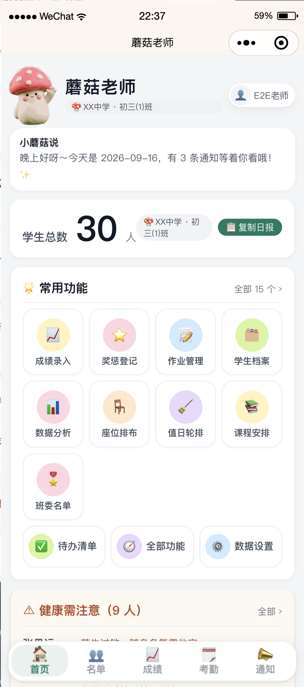
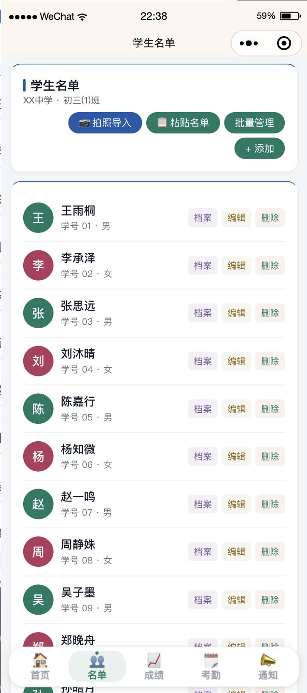
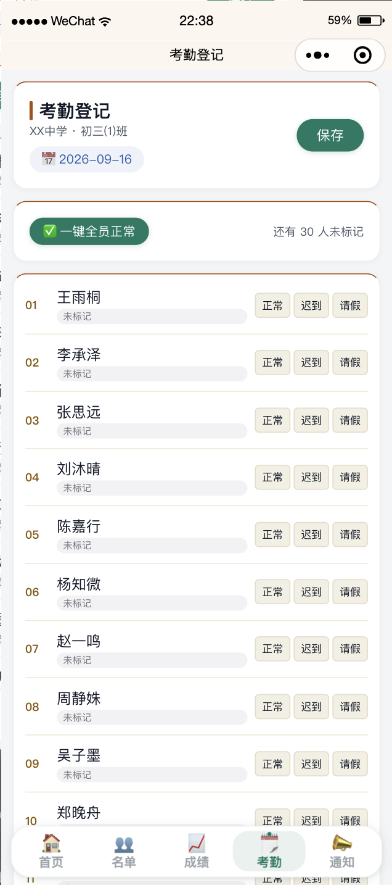
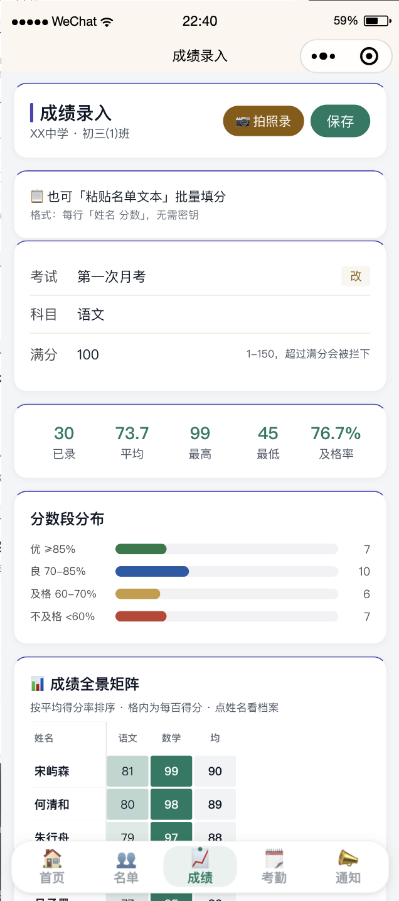
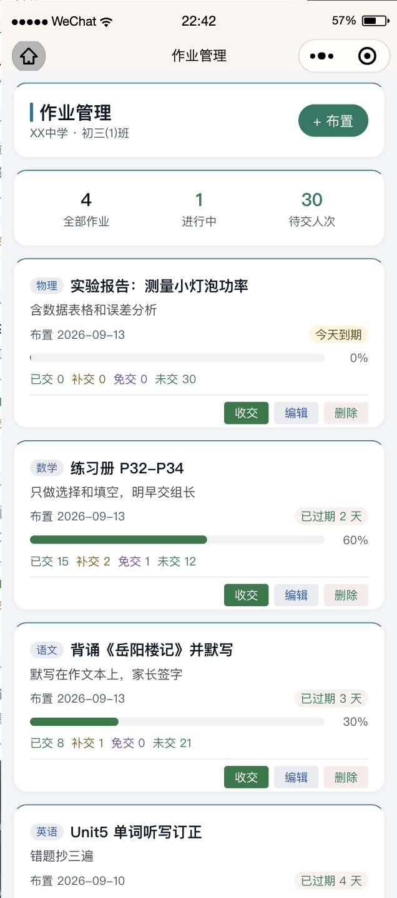
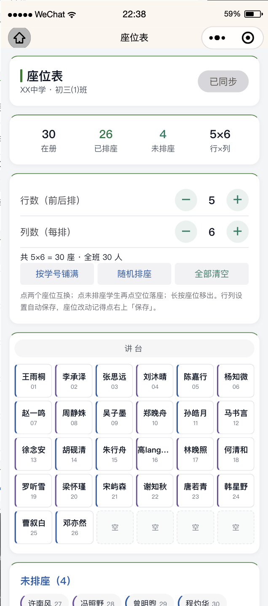
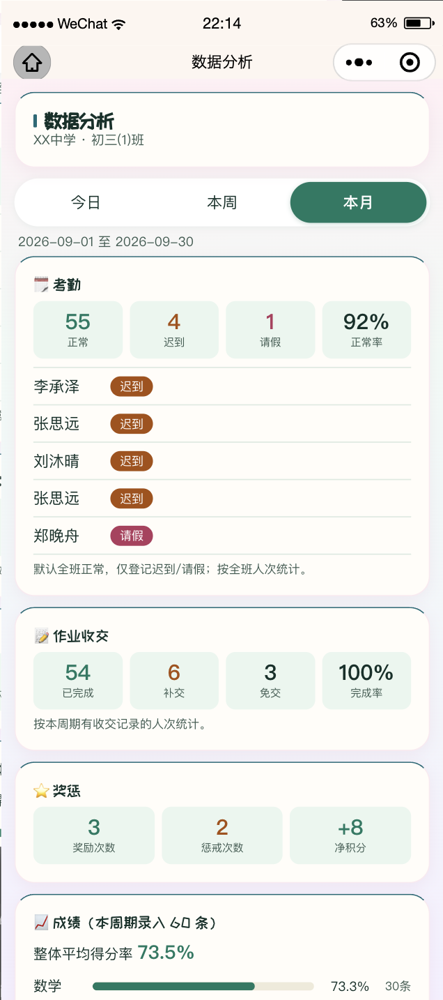
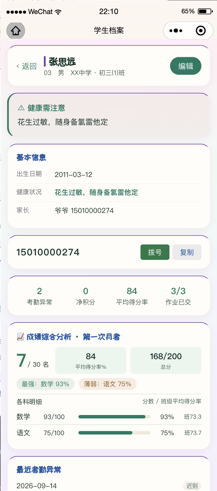

<div align="center">
  
  <h1>蘑菇老师 · 班主任工作台</h1>
  <p>微信小程序 + 云开发，班主任的手机管班助手</p>
  <p>
    
    
    
  </p>
</div>

## 简介

给老师（尤其是班主任）用的一站式班级管理小程序：名单、考勤、成绩、作业、座位、值日、课表、奖惩、档案、通知……共 **15 个模块**，手机端随手记，数据实时同步。

- 🔒 **数据私有**：部署到你自己的微信云开发环境，记录按 `_openid` 行级隔离，你的学生数据只在你手里
- 📷 **拍照录成绩**（可选）：拍一张成绩单，视觉大模型自动识别填入，支持混元等 OpenAI 兼容接口，密钥只存你自己的云库
- 👀 **演示模式**：不配置云环境也能打开预览全部界面
- ✅ **质量门禁**：内置静态检查 / E2E / 红蓝对抗测试脚本（见 `docs/AUDIT.md`）

## 界面预览

| 首页工作台 | 学生名单 | 考勤登记 | 成绩管理 |
|---|---|---|---|
|  |  |  |  |

| 作业管理 | 座位排布 | 周期分析 | 学生档案 |
|---|---|---|---|
|  |  |  |  |

## 快速开始

> 需要：微信开发者工具 + 一个微信小程序 AppID（个人可免费注册，也可用测试号）

1. **导入项目**：克隆本仓库，微信开发者工具 → 导入项目 → 选择目录，AppID 填你自己的
2. **开通云开发**：开发者工具点「云开发」→ 创建环境 → 复制**环境 ID**
3. **配置环境**：在项目根目录新建 `env.local.js`（已 gitignore）：
   ```js
   module.exports = { envId: '你的环境ID' };
   ```
   不配也能运行 —— 自动进入演示模式（界面可预览，无数据）。
4. **部署云函数**：`cloudfunctions/` 下这 4 个，逐个右键「上传并部署：云端安装依赖」：
   `login` / `api` / `initdb` / `seed`（`ocrScore` 为拍照录成绩，可选；`dbfix`、`rosterfix` 是一次性维护函数，无需部署）
5. **初始化数据**：云开发控制台 → 云函数 → 先运行 `initdb`（创建 25 个集合）→ 再运行 `seed`（灌入演示班级数据，可随时在「设置」里清空）
6. **编译预览**，开始管班 🍄

想开「拍照录成绩」：腾讯云混元申请 API Key，在小程序「设置 → AI 识别密钥」粘贴即可（详见 `docs/AI-PLAN.md`）。

## 目录结构

```
├── app.js / app.json / app.wxss   # 入口、路由、全局样式（萌系奶油风主题）
├── pages/                          # 18 个页面：dashboard / roster / grades / attendance ...
├── cloudfunctions/                 # 云函数：api（统一接口）/ login / initdb / seed / ocrScore ...
├── utils/                          # 校验、班级信息、弹层等前端工具
├── custom-tab-bar/                 # 自定义底部导航
├── tools/                          # 质量门禁：check.js 静态检查 / e2e / 红队变异测试 / 截图比对
└── docs/                           # API.md / AUDIT.md（已修 bug 台账）/ RELEASE.md / AI-PLAN.md
```

## 技术栈

原生微信小程序（WXML/WXSS/JS，零框架零构建）+ 微信云开发（云函数 + 云数据库），无第三方前端依赖，克隆即用。

## License

[MIT](LICENSE) © 2026 Dentist1112 —— 随便用，改完记得回来点个 ⭐️
